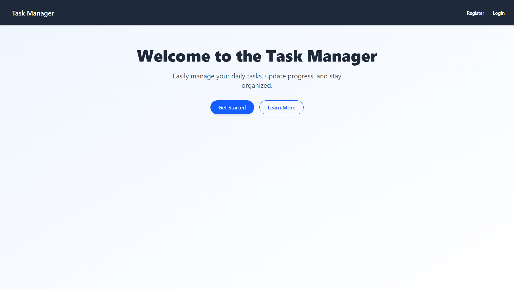
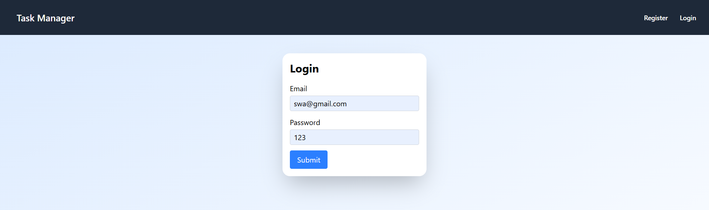
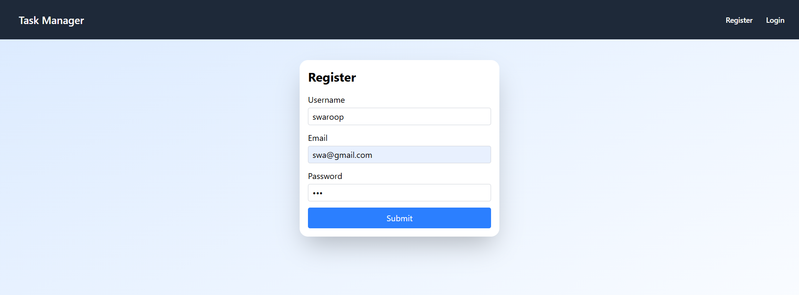
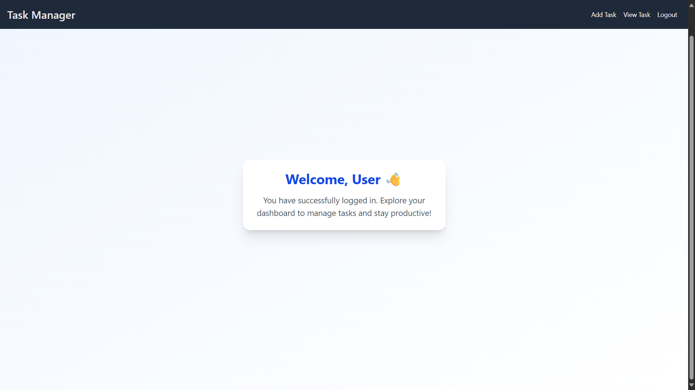
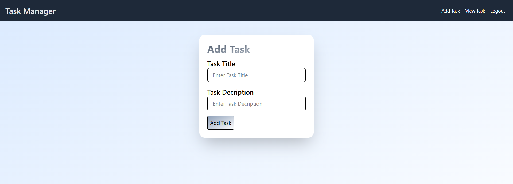
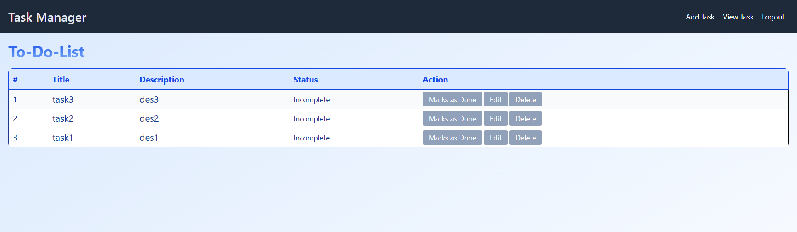
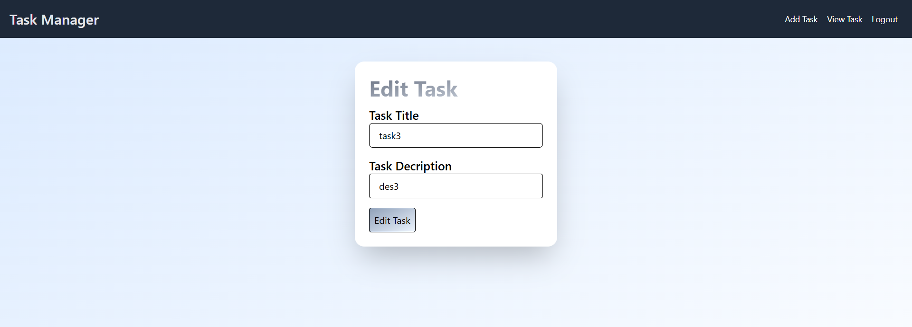

# Mern-CRUD-Operation
A basic MERN Stack application demonstrating **CRUD (Create, Read, Update, Delete)** operations.

📚 Tech Stack

- **MongoDB** – NoSQL Database
- **Express.js** – Web Framework for Node.js
- **React.js** – Frontend Library
- **Node.js** – Runtime Environment

🚀 Features

- 🔹 Create new records
- 🔹 Read and display records
- 🔹 Update existing records
- 🔹 Delete records

📁 Project Structure

```bash
Mern-CRUD-Operation/
├── client/               # React Frontend
│   ├── src/
│   │   ├── components/
│   │   └── App.jsx
│   └── public/
├── server/               # Node.js + Express Backend
│   ├── models/
│   ├── routes/
│   ├── controllers/
│   └── server.js
├── .gitignore
├── README.md
└── assets
````

## 🛠️ Getting Started

### Prerequisites

* Node.js
* MongoDB (local or cloud like MongoDB Atlas)

---

### 1️⃣ Clone the Repository

```bash
git clone https://github.com/swaroop-p-r/Mern-CRUD-Operation.git
cd Mern-CRUD-Operation
```

---

### 2️⃣ Backend Setup (Server)

```bash
cd server
npm install
npm run dev
```

> Make sure MongoDB is running on your machine or update the MongoDB URI in `.env`.

---

### 3️⃣ Frontend Setup (Client)

```bash
cd ../client
npm install
npm run dev
```

The frontend will typically run on `http://localhost:5173` and the backend on `http://localhost:5000`.

---

## 📸 Screenshots

### 🏠 Home Screen


### 🔐 User Login


### 📝 User Register


### 🧑‍💼 User Home


### ➕ Add Task


### 🗂️ View Task


### ✏️ Edit Task


---
